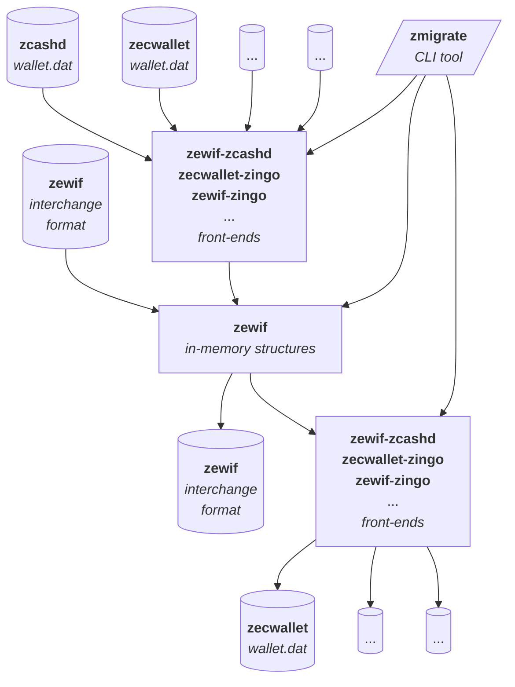

# zmigrate: ZCash Migration Framework

<!--Guidelines: https://github.com/BlockchainCommons/secure-template/wiki -->

### _by Blockchain Commons, Wolf McNally, and the Zcash Community_

---

## Introduction

The zmigrate crate is the start of a framework for the universal translation of ZCash wallet formats.

Currently it parses the `zcashd` and `zingo` formats into memory, and outputs a the debug representation of the parsed data.

## Prerequisites

You will need a `zcashd` or `zingo` wallet.dat file to test with. Some `wallet.dat` files may be found in the `zcash-wallet-formats` repo [here](https://github.com/zingolabs/zcash-wallet-formats/tree/master/zcashd/dat_files). They have been copied into this repo at `test/fixtures/`.

Because `zcashd` uses BerkelyDB, you will need to have the `db_dump` tool installed on your system. On macOS, `db-dump` is part of the `berkeley-db` package, which can be installed with Homebrew:

```sh
brew install berkeley-db
```

The `zingo` format requires no additional tools.

## Getting Started

After cloning this repo, you can run the following command to parse a wallet.dat file and write the parsed data to a file. You do need to specify as the first argument whether you are parsing a `zcash` or `zingo` wallet.dat file.

```sh
cargo run -- [zcash|zingo] path/to/wallet.dat > wallet-dump.txt
```

For `zcash`, the tool will first print out a summary of the keys in the wallet.

For both formats, it will then dump the contents of the wallet to the file `wallet-dump.txt` in Rust debug format. If it encounters an error, it will print a list of the nested error contexts and exit.

It is convenient to review the Rust debug output in VS code, as the editor allows collapsing of indented sections. The Shift key can be used to do this recursively.

If local installation is desired (not recommended at this time), you can install the tool with:

```sh
cargo install --path .
```

## Status

### What's working

- Parses all `zcashd` and `zingo` wallet files in the `zcash-wallet-formats` repo as of 2025-02-24.
- The parsing framework is designed to be extensible to other wallet formats, and uses a single `parse!` macro to flexibly parse fields of various structures using type inference wherever possible, but also allows the specification of types where necessary.
- The parsing framework handles deeply-nested structures, and is designed to give useful context when errors occur.
- The `zcashd` directory contains specializations of the parsing framework for the way that `zcashd` structures are serialized in `wallet.dat` files. These may or may not ultimately be shared with other wallet formats.
- The `zingo` directory only contains specializations of the highest-level structures, relyin on `zingolib` and its dependencies to parse the lower-level structures.

### What's not working

- No decryption of encrypted fields in the `zcash` wallet format is performed yet. This will be necessary to fully parse the wallet into in-memory structures that can be written to a wallet interchange format or other wallet formats.
- Not all documented keys in the `zcashd` wallet format have implementations. A survey of which keys are currently being parsed is available in the [src/zcashd/KEYS.md](src/zcashd/KEYS.md) file.

### What's needed

- The main effort now is to find common abstractions between the `zcashd` and `zingo` formats, and to refactor the `zmigrate` framework to extract these commonalities from the `zcashd` and `zingo` in-memory structures.
- More testing with a wider variety of `wallet.dat` files.
- PRs that either correct errors, or add new parsing capabilities, such as decryption of encrypted structures.
- The `zcash-wallet-formats` repo needs PRs to add more `wallet.dat` files to test with.
- Wallets of other formats listed in the `zcash-wallet-formats` repo need to be added to the parsing framework.

### The Future

The goal is to create a universal wallet migration framework that can translate between any wallet formats, and that can be used to create wallet interchange formats that can be used to migrate wallets between different wallet apps.

- The core `zmigrate` crate, which vends the command line tool.
- The `zewif` crate contains the universal parsing framework and in-memory abstractions. This crate also directly supports the reading and writing of the `zewif` interchange format, which is based on Gordian Envelope.
- Several *front-end back-end libraries* that support the parsing of wallet formats into `zewif` abstractions, and translating those abstractions to their format.



## Origin, Authors, Copyright & Licenses

Unless otherwise noted (either in this [/README.md](./README.md) or in the file's header comments) the contents of this repository are Copyright © 2024 by Blockchain Commons, LLC, and are [licensed](./LICENSE) under the [spdx:BSD-2-Clause Plus Patent License](https://spdx.org/licenses/BSD-2-Clause-Patent.html).

In most cases, the authors, copyright, and license for each file reside in header comments in the source code. When it does not, we have attempted to attribute it accurately in the table below.

## Financial Support

Gordian Envelope is a project of [Blockchain Commons](https://www.blockchaincommons.com/). We are proudly a "not-for-profit" social benefit corporation committed to open source & open development. Our work is funded entirely by donations and collaborative partnerships with people like you. Every contribution will be spent on building open tools, technologies, and techniques that sustain and advance blockchain and internet security infrastructure and promote an open web.

To financially support further development of Gordian Envelope and other projects, please consider becoming a Patron of Blockchain Commons through ongoing monthly patronage as a [GitHub Sponsor](https://github.com/sponsors/BlockchainCommons). You can also support Blockchain Commons with bitcoins at our [BTCPay Server](https://btcpay.blockchaincommons.com/).

## Contributing

We encourage public contributions through issues and pull requests! Please review [CONTRIBUTING.md](./CONTRIBUTING.md) for details on our development process. All contributions to this repository require a GPG signed [Contributor License Agreement](./CLA.md).

### Discussions

The best place to talk about Blockchain Commons and its projects is in our GitHub Discussions areas.

[**Gordian Developer Community**](https://github.com/BlockchainCommons/Gordian-Developer-Community/discussions). For standards and open-source developers who want to talk about interoperable wallet specifications, please use the Discussions area of the [Gordian Developer Community repo](https://github.com/BlockchainCommons/Gordian-Developer-Community/discussions). This is where you talk about Gordian specifications such as [Gordian Envelope](https://github.com/BlockchainCommons/BCSwiftSecureComponents/blob/master/Docs/00-INTRODUCTION.md), [bc-shamir](https://github.com/BlockchainCommons/bc-shamir), [Sharded Secret Key Reconstruction](https://github.com/BlockchainCommons/bc-sskr), and [bc-ur](https://github.com/BlockchainCommons/bc-ur) as well as the larger [Gordian Architecture](https://github.com/BlockchainCommons/Gordian/blob/master/Docs/Overview-Architecture.md), its [Principles](https://github.com/BlockchainCommons/Gordian#gordian-principles) of independence, privacy, resilience, and openness, and its macro-architectural ideas such as functional partition (including airgapping, the original name of this community).

[**Gordian User Community**](https://github.com/BlockchainCommons/Gordian/discussions). For users of the Gordian reference apps, including [Gordian Coordinator](https://github.com/BlockchainCommons/iOS-GordianCoordinator), [Gordian Seed Tool](https://github.com/BlockchainCommons/GordianSeedTool-iOS), [Gordian Server](https://github.com/BlockchainCommons/GordianServer-macOS), [Gordian Wallet](https://github.com/BlockchainCommons/GordianWallet-iOS), and [SpotBit](https://github.com/BlockchainCommons/spotbit) as well as our whole series of [CLI apps](https://github.com/BlockchainCommons/Gordian/blob/master/Docs/Overview-Apps.md#cli-apps). This is a place to talk about bug reports and feature requests as well as to explore how our reference apps embody the [Gordian Principles](https://github.com/BlockchainCommons/Gordian#gordian-principles).

[**Blockchain Commons Discussions**](https://github.com/BlockchainCommons/Community/discussions). For developers, interns, and patrons of Blockchain Commons, please use the discussions area of the [Community repo](https://github.com/BlockchainCommons/Community) to talk about general Blockchain Commons issues, the intern program, or topics other than those covered by the [Gordian Developer Community](https://github.com/BlockchainCommons/Gordian-Developer-Community/discussions) or the
[Gordian User Community](https://github.com/BlockchainCommons/Gordian/discussions).

### Other Questions & Problems

As an open-source, open-development community, Blockchain Commons does not have the resources to provide direct support of our projects. Please consider the discussions area as a locale where you might get answers to questions. Alternatively, please use this repository's [issues](./issues) feature. Unfortunately, we can not make any promises on response time.

If your company requires support to use our projects, please feel free to contact us directly about options. We may be able to offer you a contract for support from one of our contributors, or we might be able to point you to another entity who can offer the contractual support that you need.

### Credits

The following people directly contributed to this repository. You can add your name here by getting involved. The first step is learning how to contribute from our [CONTRIBUTING.md](./CONTRIBUTING.md) documentation.

| Name              | Role                | Github                                            | Email                                 | GPG Fingerprint                                    |
| ----------------- | ------------------- | ------------------------------------------------- | ------------------------------------- | -------------------------------------------------- |
| Christopher Allen | Principal Architect | [@ChristopherA](https://github.com/ChristopherA)  | \<ChristopherA@LifeWithAlacrity.com\> | FDFE 14A5 4ECB 30FC 5D22  74EF F8D3 6C91 3574 05ED |
| Wolf McNally      | Contributor         | [@WolfMcNally](https://github.com/wolfmcnally)    | \<Wolf@WolfMcNally.com\>              | 9436 52EE 3844 1760 C3DC  3536 4B6C 2FCF 8947 80AE |

## Responsible Disclosure

We want to keep all of our software safe for everyone. If you have discovered a security vulnerability, we appreciate your help in disclosing it to us in a responsible manner. We are unfortunately not able to offer bug bounties at this time.

We do ask that you offer us good faith and use best efforts not to leak information or harm any user, their data, or our developer community. Please give us a reasonable amount of time to fix the issue before you publish it. Do not defraud our users or us in the process of discovery. We promise not to bring legal action against researchers who point out a problem provided they do their best to follow the these guidelines.

### Reporting a Vulnerability

Please report suspected security vulnerabilities in private via email to ChristopherA@BlockchainCommons.com (do not use this email for support). Please do NOT create publicly viewable issues for suspected security vulnerabilities.

The following keys may be used to communicate sensitive information to developers:

| Name              | Fingerprint                                        |
| ----------------- | -------------------------------------------------- |
| Christopher Allen | FDFE 14A5 4ECB 30FC 5D22  74EF F8D3 6C91 3574 05ED |

You can import a key by running the following command with that individual’s fingerprint: `gpg --recv-keys "<fingerprint>"` Ensure that you put quotes around fingerprints that contain spaces.
