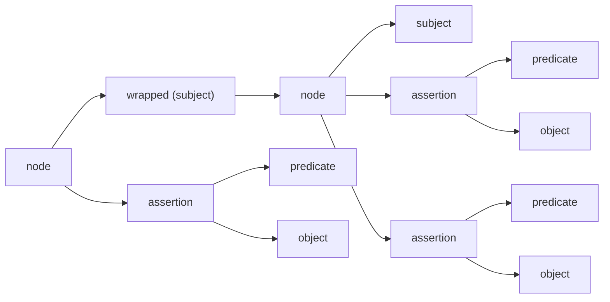

# How To Use Attachments with ZeWIF

The ZeWIF data format is build on [Gordian Envelope](https://developer.blockchaincommons.com/envelope/). This provides it with access to many additional features that might not be utilized in the first iteration of the ZeWIF standard but which may be of use in the future, including compression, elision, and encryption.

Another special feature of Envelope is the "attachment", which is fully detailed in [BCR-2023-006](https://github.com/BlockchainCommons/Research/blob/master/papers/bcr-2023-006-envelope-attachment.md) and summarized here. Attachments _are_ used in ZeWIF, specifically to store content for certain data classes.

## Data Classes in ZeWIF

ZeWIF organizes data into three classes:

* **Class I.** Data that is stored by two or more different wallets and is considered important and up-to-date.
* **Class II.** Data that is stored by less than two wallets or that is considered less important or less up-to-date.
* **Class III.** Data that is considered unimportant, not up-to-date, and is typically not in use by multiple wallets.

Class I data is defined in the ZeWIF spec. Most of this encoding is done through specific CBOR tags, but the specified data structures may incorporate spaces to include attachments, so that all data of a specific type is kept together. Class II data should still be stored as part of a ZeWIF file, but is not specified, so the storage is done through attachments. Class III data is not considered important enough to store, but should still be maintained as part of an attachment containing the entirety of the original wallet data file that is being migrated.

To clarify attachments may be found in three places in a ZeWIF data file:

* **Standard Attachments.** These are defined in the ZeWIF spec as places for attachments as parts of standardized data structures.
* **Freeform Attachments.** These are not defineed in the ZeWIF spec. They are additional attachments that are added to incorporate data not part of the spec.
* **Data File.** This is a special attachment that holds the complete data file of the exporting wallet, so that all class III data can later be recoverd if the classification was in error (or so that data can recovered following an import error that was ignored by the user).

## Envelope Technical Overview

The [Gordian Envelope](https://developer.blockchaincommons.com) is fully defined in an [IETF Internet-Draft](https://datatracker.ietf.org/doc/draft-mcnally-envelope/). Understanding of the Envelope data format is _not_ required to the zmigrate migration tool, even if input is occurring from ZeWIF files or output is occurring to ZeWIF files. The ZeWIF spec fully details what is needed to understand its content; it just happens to defined in a format that is fully compatible with the Envelope spec.

Nonetheless, the following major points are useful as an overview for ZeWIF storage:

* **Envelope Uses CBOR.** Envelope is built using CBOR, a [well-specified](https://cbor.io/) and mature binary data representation format. Every Envelope is not only [legal CBOR](https://datatracker.ietf.org/doc/html/rfc8949), but also [legal dCBOR](https://datatracker.ietf.org/doc/draft-mcnally-deterministic-cbor/), a deterministic version of CBOR. Every Envelope, and therefore every ZeWIF file, can be read using CBOR tools such as [cbor.me](https://cbor.me/). (But don't read ZeWIF files containing private keys in an online site!)
* **Envelope Stores Data in a Merkle-Like Tree.** Envelope is a branching hierarchical structure. Central nodes lead to multiple branches and eventually to leaves. This allows for the organized storage of data. The tree is Merkle-like because branches can be hashed and that hash can be stored in a store to prove that data that lies under it (which may not be relevant for the first iteration of ZeWIF, but which allows for powerful elision and signatures).
* **Envelope is Built on Semantic Triples.** Data is stored in an Envelope as a sematic triple of subject-predicate-object. Each predicate-object pair is called an assertion. It applies to a subject. A node connects together a subject and zero or more assertions about that subject. 


* **Envelope Can Be Recursive.** Any subject, predicate, object, or assertion can itself be an Envelope (a semantic triple). This allows for fully recursive structures to improve organization.


* **Envelope Can Be Stored as a UR.** Blockchain Commons [Uniform Resources (UR) format](https://developer.blockchaincommons.com/ur/) supports the text encoding of CBOR data. It can be used to store a ZeWIF Envelope file and to encode it as a QR or an [Animated QR](https://developer.blockchaincommons.com/animated-qrs/). This can resolve issues of storage and transmission.
* **Envelopes Can Be Signed.** Envelopes can be "wrapped" and then signed. This is not currently supported by zmigrate, but could be used in the future to guarantee the authenticity of ZeWIF file.
* **Envelope Hashes Allow Data to Be Elided.** Some or all data in an Envelope can be elided. Hashes remain allowing for proof of content and proof signature. This is another Envelope feature not currently supported by zmigrate, but that might have future usefulness.

### Wrapped Envelopes

A "wrapped" envelope is an Envelope that has been turned into a subject for a new envelope. This allows assertions to refer to the entire content of the envelope.



This feature is a crucial element of an attachment.

## Attachments Technical Overview

Attachments are fully described in [BCR-2023-006](https://github.com/BlockchainCommons/Research/blob/master/papers/bcr-2023-006-envelope-attachment.md). It makes use of Envelope wrapping (described above) and of [known values](https://github.com/BlockchainCommons/Research/blob/master/papers/bcr-2023-002-known-value.md), which are unique unsigned 64-bit integers that are registered with Blockchain Commons and used to refer to specific, repeating concepts in a precise, compact way. They are encoded in CBOR with the `#6.40000` tag. 

* An attachment is an assertion in an envelope, meaning that it contains a predicate and an object.
* The predicate of an attachment is known value #50, which is registered as `attachment`.
* The object of an attachment is the payload of attachment data.

When creating a payload for a ZeWIF attachment you might simply dump in the otherwise unspecified data as a binary blob, matching whatever format the data was held in in the originating wallet. It's better to simplify and standardize it as much as possible as discussed in the [ZeWIF best practices](https://github.com/BlockchainCommons/zmigrate/blob/master/docs/bestpractices.md#attachments). Because an object can be a full Envelope, it's also possible to create an entire recursive data structure as the object of an attachment. As always, your guide should be what is the most accessible: in what format is the data most likely to be recovered by someone in the future?

* Once an attachment has been created, the Envelope is wrapped, turning it into the subject of a new Envelope.
* A `vendor` assertion must be added. This is a predicate of known value #51 with the object of a string for the vendor name.
* A `conformsTo` assertion may be added. (It's [highly suggested](https://github.com/BlockchainCommons/zmigrate/blob/master/docs/bestpractices.md#attachments)) for ZeWIF attachments.) This is a predicate of known value #52 with the object being a string that identifies the format of the attachment.
 
That's it! You have an attachment! You should create them for all of the data in your wallet that is not defined by the ZeWIF spec.

### Defining `vendor` and `conformsTo`

**`vendor`** must be a unique name identifying the vendor of the wallet. It's suggested as a reverse domain name, such as `org.zingolabs`. 

**`conformsTo`** is not required, but it is highly recommended, especially for ZeWIF data, since it's crucial that it be understandable in the far future. It's recommended as a URL that contains the specification describing what the data is and how it's encoded. By storing this info at a URL, you can sure it's recoverable in the far future. Even if your site is gone, archive.org or like services may have a copy.

### Versioning `conformsTo`

Your `conformsTo` should be versioned so that a user or importer can look up the precise version that data was encoded with. One way to do so is to ensure that the URL referred to in `conformsTo` includes a version, with different versions going to different URLs. Another way is to add a `conformsAt` predicate with a UNIX time object, which will allow for the lookup of a specific version of the `conformsTo` URL using a service such as archive.org. 

### Adding Other Metadata

## Encoding a Standard Attachment

## Encoding a Freeform Attachment

## Encoding a Data File


```
Deliverable # 2.2: A developer's how-to document describing the use of Envelope attachments for data not included in basic interchange format.
```
