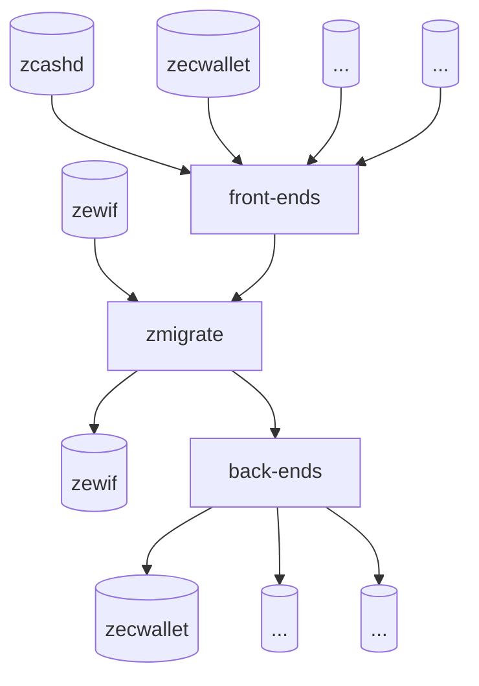

# Best Practices for Importing & Exporting Wallet Data

The ZeWIF format is a specification for the import and export of Zcash wallet data, enabling interoperability among walls, and creating freedom for users. However, the ZeWIF format also requires work from individual developers who want to interop their data, whether they are using the ZeWIF format or not.



As the above diagram shows, the zmigrate Rust crate lies at the center of the ZeWIF system. It creates in-memory representations of data from a variety of inputs and can  output that abstracted data in a numbers of forms. Obviously, it can accept input from ZeWIF and it can output to ZeWIF. However, that's just part of the process. Individual developers can also choose to use creat front ends that interface their own wallet data to zmigrate and back ends that export the data from zmigrate to their own wallet.

The following best practices offer suggestions for those front-end and back-end wallet developers, to ensure that their data remains not just maximally interoperable, but also maximally accessible, both now and in the far future.

## The Core Format

***Break Apart Composite Data.***

***Use Defined CBOR Tags.***

## Key Migration

***Migrate Existing Assets As They Are, Usually.***

***Migrate Sprout-Keyed Assets If Possible.***

***Resolve Bugs If Possible.***

Zecwallet-cli BIP39 derivation bug
In v1.0 of zecwallet-cli, there was a bug that incorrectly derived HD wallet keys after the first key. That is, the first key, address was correct, but subsequent ones were not.

The issue was that the 32-byte seed was directly being used to derive then subsequent addresses instead of the 64-byte pkdf2(seed). The issue affected both t and z addresses.

Note that no funds are at risk. The issue is that, if in the future, you import the seed into a different wallet, you might not see all your addresses in the new wallet, so it's better to fix it now.


## Attachments

***Drop Wallet-Specific Configuration.***

1. Can drop wallet specific stuff, like minversion

***Store Undefined Data with Attachments.***

***Document Attachments Whenever Possible.***

ways to define things better than bstring [blob]? 
[+metadata, date, etc.]

***Store the Entire Data Set.***

## Encryption

***Decrypt All Data.***

***Re-Encrypt for Insecure Transmission.***

***Re-Encrypt for Storage.***

can encrypt with encryption or SSKR [can be done with Envelope tool, not in spec]

## Elision & Compression

***Compress as Necessary.***

***Elide Thoughtfully.***

Be clear that anything can be wrapped to elide, compress [e.g. large string, not random numbers] if space tight

may want to differentiate between what would give to an auditor and to a wallet: might do as multiple attachments [privacy-breaking]

```
Deliverable # 3.4: A best practices document on importing & exporting data.
```
