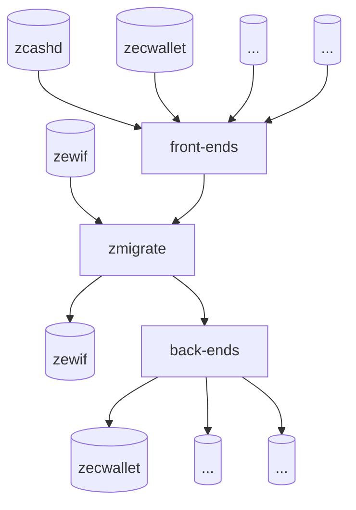

# Best Practices for Importing & Exporting Wallet Data

The ZeWIF format is a specification for the import and export of Zcash wallet data, enabling interoperability among walls, and creating freedom for users. However, the ZeWIF format also requires work from individual developers who want to interop their data, whether they are using the ZeWIF format or not.



As the above diagram shows, the zmigrate Rust crate lies at the center of the ZeWIF system. It creates in-memory representations of data from a variety of data inputs and can  output that abstracted data in a numbers of forms. Obviously, it can accept input from ZeWIF and it can output to ZeWIF. However, that's just part of the process. Individual developers can also choose to use zmigrate when they are importing data from their wallet or to export data to their wallet.

The following best practices offer suggestions for those wallet developers, to ensure that their data remains not just maximally interoperable, but also maximally accessible, both now and in the far future.

```
Deliverable # 3.4: A best practices document on importing & exporting data.
```
