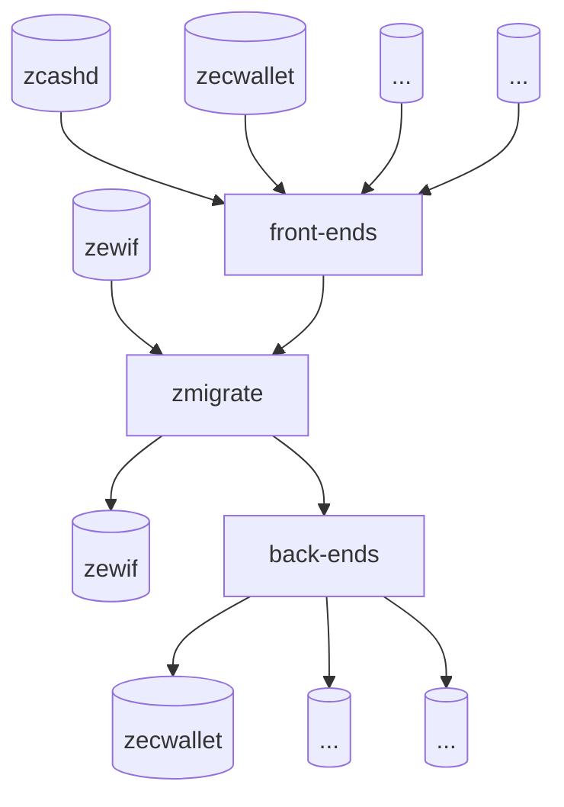

# Best Practices for Importing & Exporting Wallet Data

The ZeWIF format is a specification for the import and export of Zcash wallet data, enabling interoperability among walls, and creating freedom for users. However, the ZeWIF format also requires work from individual developers who want to interop their data, whether they are using the ZeWIF format or not.



As the above diagram shows, the zmigrate Rust crate lies at the center of the ZeWIF system. It creates in-memory representations of data from a variety of inputs and can  output that abstracted data in a numbers of forms. Obviously, it can accept input from ZeWIF and it can output to ZeWIF. However, that's just part of the process. Individual developers can also choose to use creat front ends that interface their own wallet data to zmigrate and back ends that export the data from zmigrate to their own wallet.

The following best practices offer suggestions for those front-end and back-end wallet developers, to ensure that their data remains not just maximally interoperable, but also maximally accessible, both now and in the far future.

## The Core Format

***[Export:] Use Defined CBOR Tags.*** If there is a ZeWIF-defined CBOR tag for a piece of data that is being migrated, that CBOR tag should be used, even if it requires converting the data type as part of the migration.

* _Example:_ [an example of a CBOR and something from a wallet that should be stored in that format, especially if the wallet stores it with a different data type]

***[Export:] Break Apart Composite Data.*** If a single datum in a wallet contains several individual keys and values, they should be separated out before migrating them, even if they're related.

* _Example:_ `zcashd`'s CKeyMetaData contains a seed fingerprint (uint256), a creation date (UNIX timestamp), and an HD/ZIP-32 Keypath (string). Those datums should each be individually stored when migrated.

## Key Migration

***[All:] Use Account Abstractions.*** Some Zcash keys are based on system data, while others are HD keys derived from a seed. However, users of most wallets instead see keys grouped into accounts, which may contain related HD keys, unrelated system-randomness keys, or multiples of any of these. Since accounts represent a crucial usability tool for users to understand what is in their account and what it does, they should be preserved both through export and import, even if they represent an abstraction without any "real" meaning for how the keys relate.

* _Example:_ [This was certainly our recommendation based on the data survey and meeting #1. I assume it's how things are being done in ZeWIF? If so, we can provide examples. If not, we can dump this.]

***[Export:] Store Existing Assets As They Are, Usually.*** In the vast majority of cases, the migration process should happen without making any changes on the blockchain. This is not the time to do other clean-up, except in a few important cases. You want to preserve the data being imported as it is, because it was theoretically in a known, working state.

* _Example:_ A user has lots of Zcash dust that can't be used effectively. Nonetheless, the keys controlling that dust should be converted over. The new wallet can decide if it wants to do anything with the issue.

***[Export:] Sweep for Bugs In Asset Control If Possible.*** If your wallet did something out of spec with the larger Zcash community and it affects the control of assets, this is important to resolve before exporting your data, because future wallets will not know about the variance from the specification and it could cause lost of funds. Spec variance is mostly likely to be a variance in how keys are derived from a seed or a master key, but there might be other issues. In these cases, move funds off of the out-of-spec keys or seeds (or whatever) before migrating the wallet file.

* _Example:_ `zecwallet-cli 1.0` incorrectly derived HD wallet keys after the first key, affecting both `t` and `z` addresses. Funds on addresses after the first should be moved prior to the migration of a `zecwallet-cli 1.o` wallet as future wallets won't know about these incorrectly derived keys, and thus will not be able to access the funds without knowing specifically how to derive them.

***[Export:] Sweep Sprout-Keyed Assets If Desired.*** Since Sprout keys [are being considered for full deprecation](https://zips.z.cash/zip-2003), this might be a good time to move all Sprout-keyed funds to Sapling keys, prior to migration of the wallet data. However, this should only be done with user agreement, and it should be considered optional. (If ZIP-2003 is approved for deployment, then best practices will quickly become to sweep all Sprout funds before they become unspendable.)

* _Example:_ Version 2.0.5-2 of `zcashd` has a Sprout-to-Sapling migration tool, whose usage is fully described in [ZIP-308](https://zips.z.cash/zip-0308).

***[Export:] Ensure that Data Files Represent a Post-Sweep State.*** Even if sweep of funds is done due to specification variances or Sprout migration, ensure that it occurs before the wallet file is export and migrated.

* _Example:_ This is just a logistical reminder! You don't want to start your migration process, export your file, sweep funds, and then migrate a file that doesn't have the new sweep addresses!

## Calculated Data

***[Export:] Store All Transactions Information.*** Different wallets store different information regarding transactions. Some of it is recoverable from the blockchain, some of it is not. Nonetheless, all transaction information should be stored, whether it's recoverable or not. Storing irrecoverable information is obviously a requirement. Storing recoverable information keeps the new wallet from having to look up information on the blockchain (which is a privacy concern, as noted below). Storing everything held by a wallet ensures that you don't make a mistake and accidently omit something because you thought it was recoverable and it was not.

* _Example:_ `zcashd` mostly stores nonrecoverable information regarding transactions, such redeem scripts, but it also stores recipient addresses, which are theoretically recoverable with an outgoing viewing key. The "theoretical" in that statement is exactly why _all_ transaction data should be stored.

***[Import:] Do Not Lock Up Unknown Transaction Information.*** When you are importing transaction data, generally do not look up missing data, even if it would usually be stored for transactions in your wallet. This is because looking up transaction data can be a privacy concern: the Zcash node that you contact will know what transactions you are asking about, and therefore that they're related to your IP address. (There are alternatives, including downloading the entire blockchain to fill in missing information and using privacy-focused communication methods such as Tor.)

* _Example:_ `zcashd` does not store most of the recoverable transaction information, such as block heights, fees, prices, times, etc. This data should not be individually looked up by an importing wallet to fill in the data.

***Store Almost All Witness Trees.***

***Dump Incorrect Witness Trees.***

## Attachments

***Store Undefined Data with Attachments.***

***Drop Wallet-Specific Configuration.***

1. Can drop wallet specific stuff, like minversion
***Document Attachments Whenever Possible.***

ways to define things better than bstring [blob]? 
[+metadata, date, etc.]

***Store the Entire Data Set.***

## Encryption

***Decrypt All Data.***

***Re-Encrypt for Insecure Transmission.***

***Re-Encrypt for Storage.***

can encrypt with encryption or SSKR [can be done with Envelope tool, not in spec]

## Elision & Compression

***Compress as Necessary.***

***Elide Thoughtfully.***

Be clear that anything can be wrapped to elide, compress [e.g. large string, not random numbers] if space tight

may want to differentiate between what would give to an auditor and to a wallet: might do as multiple attachments [privacy-breaking]

## Reports

***Report All Failures.***

***Flag Asset Failures in Red.***


```
Deliverable # 3.4: A best practices document on importing & exporting data.
```
